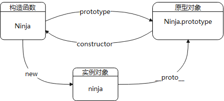
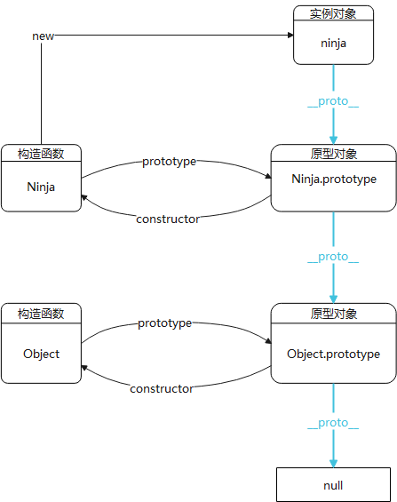

# 一、js的原型  
我们先看一个基础的例子，通过构造函数新建一个实例。
```js
function Ninja = fucntion() {
    this.swung = false;
}
Ninja.prototype.swingSword = function () {
    this.swung = true;
}
var ninja = new Ninja();
```
在说原型之前有几个基础概念需要了解:
1. 构造函数：用来初始化新对象的函数，这里`Ninja`函数就是构造函数。
2. 实例对象：通过构造函数new操作新建的对象，这里`ninja`就是实例对象。
3. 构造过程：`new Ninja()`; 创建一个空对象{}，将此空对象作为上下文，传给`Ninja`函数，最后赋给`ninja`。所以，函数作为构造器调用时，其上下文是这个新建的对象，this指向它。
4. `prototype`：原型对象是在 **调用`new Ninja()`** 时创建的，构造函数有一个 `prototype`属性，原型对象最后会被关联到这个`Ninja.prototype`上。**通过同一个构造函数新建的不同实例对象，他们的原型对象是相同的，可以让所有实例对象共享原型对象包含的属性和方法**。原型对象中`construct`和`__proto__`两个属性会被自动创建，经常使用原型对象来实现继承。
5. `constructor`：原型对象有个constructor属性，指向该原型对象的构造函数。由于实例对象可以继承原型对象的属性，所以实例对象也有constructor属性，也指向原型对象对应的构造函数。
6. `__proto__`：实例对象有个`__proto__`属性，指向该实例对象对应的原型对象,所以可以通过实例对象的`__proto__`属性来查看原型对象的内容,也可以用`Object.getPrototypeOf(实例对象)`来查看原型对象内容。  

>`__proto__`是站在对象的角度讨论原型对象，指向构造函数的原型对象。(每个对象都有这个隐式属性)  
`prototype`是站在构造函数的角度讨论原型对象。(每个函数都有这个属性)  

有上面概念，我们就很容易画出构造函数、原型对象、实例对象间的关系。  



## 原型链
>前面理清了构造函数、原型对象、实例对象间的关系。当我们要查找一个实例对象的属性时，会先查找构造过程中创建的私有属性，然后查找原型对象（`ninja.__proto__`）上的公有属性。如果都没找到，那接下来呢？  

我们知道原型也是对象，既然是对象，那么它也有对应的原型，所要查找的属性会继续在ninja原型的原型上查找，直到终点`Object.prototype`。这样形成一个链条，称之为原型链。下图中蓝色__proto__线即为原型链走向。  



