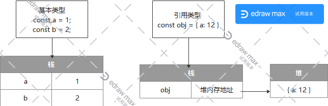

>js中数据类型分为两类：
- 基本数据类型：number、string、boolean、null、undefined，以及es6新增的symbol、bigint。
- 引用数据类型：对象（普通对象、数组、正则、Math、Date、函数）。
  
## 基本数据类型和引用数据类型的区别  
> 栈（stack）和堆（heap）：stack为自动分配的内存空间，它由系统自动释放；而heap则是动态分配的内存，大小也不一定会自动释放
- 基本数据类型（值类型）由于结构简单，数据大小确定，内存空间大小可以分配，它们可以直接保存在栈内存中。赋值的变量指向具体值。  
- 引用数据类型（引用类型）存放在堆内存中，所赋值的变量指向堆内存中的地址。所以当a、b两个引用类型指向同一地址时，修改一个，另一个也随之改变。  


## 如何判断类型
>判断数据类型一般可以通过四种方法：typeof、instanceof、constructor、Object.prototype.toString.call。
```js
const num = 1;
const str = '';
const bool = true;
const nul = null;
const und = undefined;
const arr = [1,2];
const obj = {a: 1};
const fun = function () {};
```  

### typeof
```js
typeof num; // number
typeof str; // string
typeof bool; // boolean
typeof nul; // object
typeof und; // undefined
typeof arr; // object
typeof obj; // object
typeof fun; // function
```
typeof能准确判断基本类型，但对于引用类型就力不从心，可以看到对于null、arr、object都返回object。详细信息可以参考[typeof-mdn](https://developer.mozilla.org/zh-CN/docs/Web/JavaScript/Reference/Operators/typeof)  
JS类型值是存在32 BIT 单元里,32位有1-3位表示TYPE TAG,其它位表示真实值  
而表示object的标记位正好是低三位都是0  
000: object. The data is a reference to an object.   

而js里的Null 是机器码NULL空指针, (0x00 is most platforms).所以空指针引用 加上 对象标记还是0,最终体现的类型还是object..  
这也就是为什么Number(null)===0吧...


## 类型间的转换
