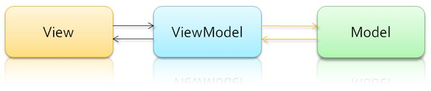
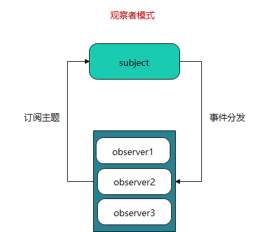
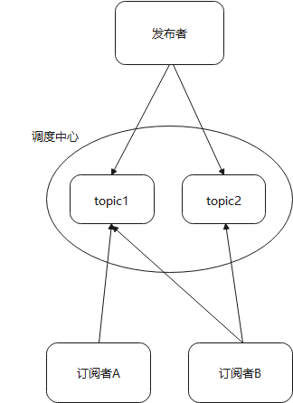

# 什么是MVVM?
MVVM是Model-View-ViewModel的简写。  
在Vue中:  
- `Model`：指的是js中的数据，如对象，数组等等。
- `View`：指的是页面视图
- `viewModel`：指的是vue实例化对象，它是连接view和model的桥梁。  

它有两个方向：
1. 将【模型】转化成【视图】，即将后端传递的数据转化成所看到的页面。实现的方式是：**数据绑定**。
2. 将【视图】转化成【模型】，即将所看到的页面转化成后端的数据。实现的方式是：**DOM 事件监听**。  

这两个方向都实现的，我们称之为**数据的双向绑定**。  



# 数据劫持  

> `Object.defineProperty()`方法会直接在一个对象上定义一个新属性，或者修改一个对象的现有属性，并返回此对象。  

## 语法
```js
/**
* obj 要定义的属性
* prop 要定义或修改的属性或[Symbol]
* descriptor 要定义或修改的属性描述符
*/
Object.defineProperty(obj, prop, descriptor)
```

### 属性描述符（descriptor）
- `configurable`：目标属性是否可以**再次修改属性的特性**（writable, configurable, enumerable），目标属性是否可以使用delete删除。
- `enumerable`：是否可被枚举（使用`for...in`/`Object.keys()`）。**默认为false**
- `value`：属性对应的值,可以使任意类型的值。**默认为undefined**
- `writable`：属性的值是否可以被重写。**默认为false**
- `get`：在读取属性时调用的函数。**默认值为 undefined**。
- `set`：在写入属性时调用的函数。**默认值为 undefined**。  

> **注意：**get,set设置时不能设置writable和value，它们代替了二者且是互斥的。  

# 观察者模式/发布-订阅模式  
## 1. 观察者模式  
>观察者模式定义了对象间的一种**一对多的依赖关系**，当一个对象状态发生改变，所有依赖于它的对象都将得到通知，并自动更新。观察者模式属于行为型模式，行为型模式关注的是对象之间的通讯，观察者模式就是观察者和被观察者之间的通讯。  



```javascript
// 订阅目标主题
class Subject {
  constructor() {
    this.observers = []
  }

  add(observer) {
    this.observers.push(observer)
  }

  notify(...args) {
    this.observers.forEach(observer => {
      observer.update(...args)
    })
  }
}
// 观察者
class Observer {
  update(...args) {
    console.log(args)
  }
}

const obj1 = new Observer()
const obj2 = new Observer()
const sub = new Subject()
// 目标添加观察者
sub.add(obj1)
sub.add(obj2)
// 目标通知观察者
sub.notify('notify event')
```

## 发布订阅模式  
> 发布订阅模式是观察者模式的一个变种。消息的发送方，叫做**发布者（publishers）**，消息的接收方叫做订阅者（subscriber）。在发布者和订阅者之间存在**调度中心**，它维持着发布者和订阅者之间的联系，过滤所有发布者传入的消息，相应的分发给他们的订阅者。 

简言之，订阅者把自己想订阅的事件注册到调度中心，当该事件触发时候，发布者发布该事件到调度中心（顺带上下文），由调度中心统一调度订阅者注册到调度中心的处理代码。

不同于观察者模式，目标和观察者直接的依赖关系。发布者和订阅者不知道彼此的存在，全由调度中心维持联系。  


```js
// 事件调度中心，为订阅者发布者提供调度服务
class PubSub {
  constructor() {
    this.subscribers = {}
  }

  subscribe(topic, callback) {
    const callbacks = this.subscribers[topic]
    if (!callbacks) {
      this.subscribers[topic] = [callback]
    } else {
      callbacks.push(callback)
    }
  }

  publish(topic, ...args) {
    const callbacks = this.subscribers[topic] || []
    callbacks.forEach(callback => {
      callback(...args)
    })
  }
}

// 创建事件调度中心 
const pubSub = new PubSub()
// 订阅事件A
const subscriber1 = pubSub.subscribe('topicA', args => {
  console.log('订阅topicA回调'，args)
})
const subscriber2 = pubSub.subscribe('topicA', args => {
  console.log('订阅topicA回调2'，...args)
})
// 发布事件A
pubSub.publish('topicA', '发布', 'topicA')
```

## 差异
- 在**观察者模式**中，观察者是知道Subject的，Subject一直保持对观察者进行记录。然而，在**发布订阅模式**中，发布者和订阅者**不知道对方的存在**。它们只有通过消息代理进行通信。  
- 在发布订阅模式中，组件是松散耦合的，正好和观察者模式相反。
- **观察者模式**大多数时候是**同步**的，比如当事件触发，Subject就会去调用观察者的方法。而**发布-订阅模式**大多数时候是**异步**的（使用消息队列）。  

# 